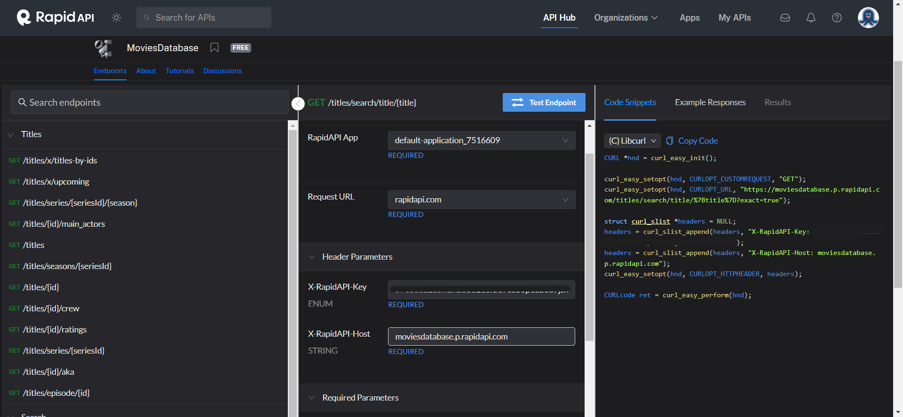
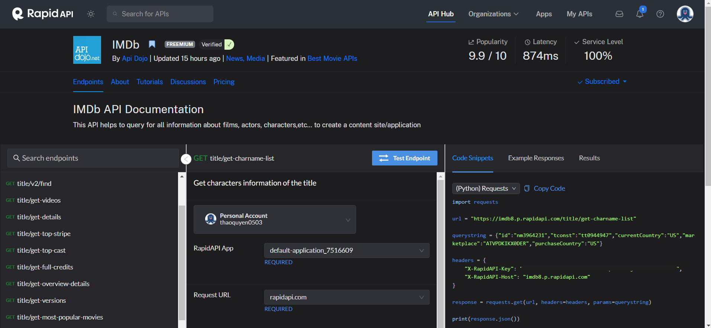
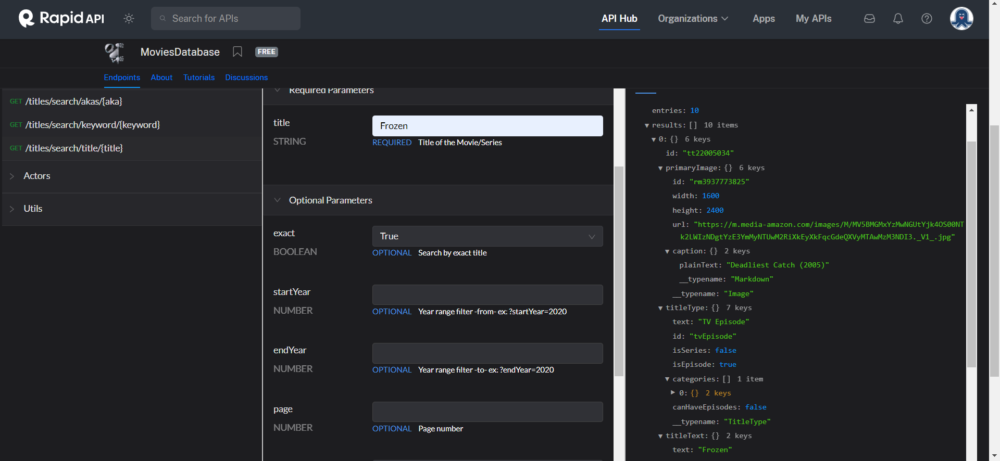
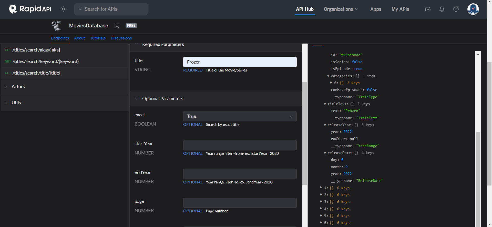
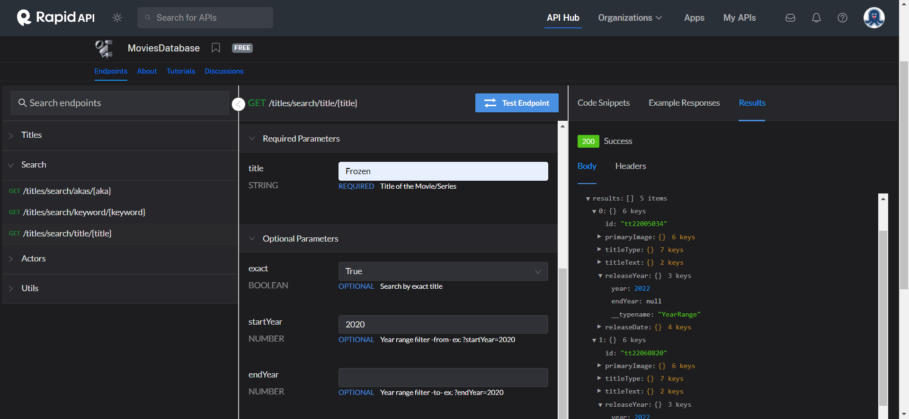
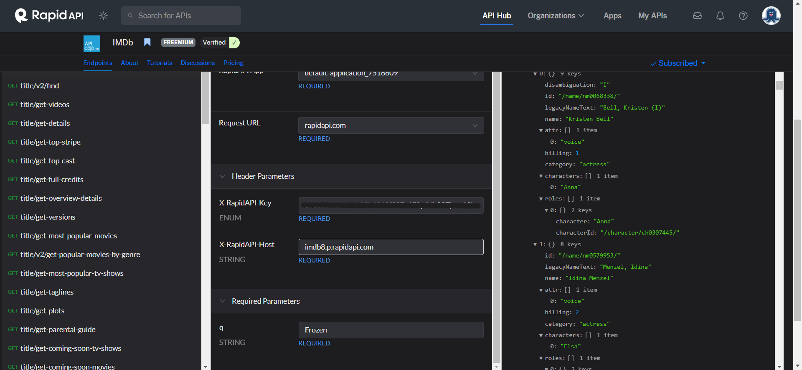
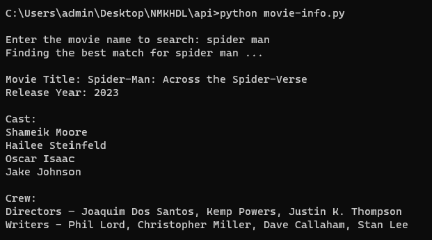
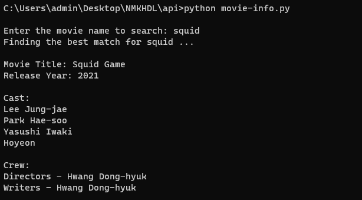

# Tài liệu về dữ liệu API và Ứng dụng của API IMDb

## MỤC LỤC
- [Tài liệu về dữ liệu API và Ứng dụng của API IMDb](#tài-liệu-về-dữ-liệu-api-và-ứng-dụng-của-api-imdb)
  - [MỤC LỤC](#mục-lục)
  - [1. Tổng quan](#1-tổng-quan)
  - [2. Gọi API](#2-gọi-api)
  - [3. Khóa API](#3-khóa-api)
  - [4. Ứng dụng](#4-ứng-dụng)
    - [Cách thực hiện](#cách-thực-hiện)
    - [4.1. Chọn API](#41-chọn-api)
    - [4.2. Lấy khóa API](#42-lấy-khóa-api)
    - [4.3. Kiểm tra điểm cuối API](#43-kiểm-tra-điểm-cuối-api)
    - [4.4. Ứng dụng API vào chương trình tìm kiếm phim](#44-ứng-dụng-api-vào-chương-trình-tìm-kiếm-phim)
      - [4.4.1. Xây dựng khung cho ứng dụng](#441-xây-dựng-khung-cho-ứng-dụng)
      - [4.4.2. Nhập tên phim cần tìm](#442-nhập-tên-phim-cần-tìm)
      - [4.4.3. Tìm kiếm thông tin phim](#443-tìm-kiếm-thông-tin-phim)
      - [4.4.4. Hiển thị chương trình](#444-hiển-thị-chương-trình)
      - [4.4.5. Kết quả](#445-kết-quả)

## 1. Tổng quan
API (viết tắt của Application Programming Interface) là giao diện lập trình ứng dụng, là giao diện giữa phần mềm với phần mềm. API cung cấp dữ liệu được yêu cầu một cách an toàn và chuẩn hóa mà không cần sự can thiệp của người dùng. Chúng ta không cần biết logic bên trong của dịch vụ, chỉ cần gửi một lệnh đơn giản và dịch vụ sẽ trả về dữ liệu cần thiết.

API được chia thành bốn loại chính: Open API, Partner API, Internal API và Composite API. Trong đó, Open API là loại API được công khai và có thể sử dụng bởi bất kỳ ai. Open API có thể được sử dụng để tạo ra các ứng dụng mới hoặc mở rộng các ứng dụng hiện có. Trong bài này, chúng tôi sẽ tập trung vào Open API.

## 2. Gọi API
Gọi API (API call) là quá trình mà ứng dụng khách gửi yêu cầu đến API của máy chủ. Một cuộc gọi API cũng bao gồm tất cả những gì xảy ra sau khi yêu cầu được gửi đi, bao gồm cả khi API lấy thông tin từ máy chủ và trả về cho ứng dụng khách.

Khách hàng muốn máy chủ thực hiện các chức năng cơ bản. Những yêu cầu này có thể được viết dưới dạng URL để giao tiếp giữa khách hàng và máy chủ, được điều chỉnh theo các quy tắc của Giao thức Truyền tải Siêu văn bản (HTTP). Bốn phương thức yêu cầu cơ bản nhất đối với máy chủ là:
- GET: Lấy dữ liệu
- POST: Tạo mới dữ liệu
- PUT: Cập nhật dữ liệu
- DELETE: Xóa dữ liệu

Ví dụ: Cách thức hoạt động của các API thường được so sánh với việc đặt món ăn tại nhà hàng, trong đó bạn là khách hàng, người phục vụ là API và đầu bếp là máy chủ. Bạn xem qua menu, chọn món ăn mà bạn muốn và đặt hàng với người phục vụ. Người phục vụ đưa yêu cầu của bạn đến đầu bếp. Đầu bếp thực hiện yêu cầu của bạn. Sau đó, người phục vụ mang đến cho bạn món ăn và bạn thưởng thức chúng mà không phải tự mình làm. Đây là cách mà API hoạt động.
Nhưng giả sử quá nhiều khách đến nhà hàng và không có đủ chỗ để đáp ứng. Hãy nói rằng điều này tiếp diễn khi nhà hàng ngày càng trở nên phổ biến hơn. Vậy thì sao? Đó là lúc khóa API (API key) xuất hiện.

## 3. Khóa API
Một API key là một định danh duy nhất được sử dụng để xác thực cuộc gọi đến một API. Key bao gồm một chuỗi các ký tự và số để xác định khách hàng (đây phải là ứng dụng hoặc trang web đang thực hiện yêu cầu). Key có thể cấp hoặc từ chối yêu cầu đó dựa trên quyền truy cập của khách hàng và theo dõi số lần yêu cầu được thực hiện cho mục đích sử dụng và thanh toán.

Bằng cách giới hạn quyền truy cập chỉ cho những người có API key, một công ty có thể kiểm soát số lượng cuộc gọi được thực hiện đến API của mình và đảm bảo chỉ một nhóm khách hàng cụ thể và đáng tin cậy mới có thể truy cập các tài nguyên máy chủ của nó.

Tiếp tục ví dụ ở trên, hãy nghĩ về một API key như một sự đặt bàn và API như một nhà hàng. Bằng cách thực thi yêu cầu khách hàng phải có đặt chỗ để ăn tại nhà hàng, bạn có thể giữ số lượng khách ở mức độ chấp nhận được để nhà bếp có thể phục vụ mỗi khách hàng một cách đầy đủ và hiệu quả. Tương tự, bằng cách chỉ cho khách hàng có API key mới có thể truy cập và sử dụng tài nguyên của bạn thông qua API, bạn giúp đảm bảo phần mềm của bạn được sử dụng một cách an toàn và có thể xử lý số lượng yêu cầu đang đến.

## 4. Ứng dụng 
### Cách thực hiện
### 4.1. Chọn API 
Điều đầu tiên cần làm là tìm kiếm một API có thể tích hợp vào ứng dụng của bạn. Bạn có thể đã chú ý đến một API nào đó, ví dụ một trong những API lớn như Instagram API, Youtube API, Spotify Web API, ... Bạn cũng có thể muốn tìm kiếm theo chi phí, ví dụ như bắt đầu với một API miễn phí trước khi khám phá các API trả tiền.

Ở đây, tôi chọn `The IMDb API`. IMDb là viết tắt của Internet Movie Database (Cơ sở dữ liệu phim trực tuyến trên Internet) và là một trang web lưu trữ thông tin về rất nhiều phim, chương trình truyền hình, trò chơi điện tử, các luồng trực tuyến trên Internet và nhiều nội dung khác. Đối với mỗi bản liệt kê phương tiện truyền thông, IMDb cũng cung cấp dữ liệu về diễn viên, đạo diễn, nhà sản xuất liên quan, tóm tắt cốt truyện, các thông tin thú vị, trích dẫn trong phim, nhận xét từ người hâm mộ và xếp hạng. 

API IMDb trên AWS Data Exchange là một API giúp chúng ta dễ dàng tìm kiếm dữ liệu cần thiết, cung cấp cấu trúc dữ liệu đơn giản và giảm số lượng cuộc gọi API chỉ với một URL, tuy nhiên ta phải trả phí để sử dụng. Có nhiều sự thay thế IMDb (như TMDb và OMDb) và các API lấy dữ liệu từ cơ sở dữ liệu phim trực tuyến mở khác có sẵn để truy cập vào cơ sở dữ liệu lớn của IMDb và giúp bạn có cái nhìn sâu sắc về dữ liệu của họ. Do đó, để có một API miễn phí và toàn diện hơn, tôi sẽ sử dụng API thay thế cho API IMDb là `Movie Database Open API` và `IMDb` trên `RapidAPI` (RapidAPI là một nền tảng quản lý API đa dịch vụ. Ngoài cung cấp các API từ nhiều nhà cung cấp khác nhau, RapidAPI còn cho phép người dùng truy cập vào các điểm cuối (endpoints) và thử nghiệm API trực tiếp). Sau khi đã chọn API, chúng ta sẽ đọc tài liệu API.

### 4.2. Lấy khóa API
Để sử dụng API, bạn cần đăng ký một tài khoản trên RapidAPI. Sau khi đăng nhập, bạn có thể tìm kiếm Movies Database API và sử dụng. Sau khi ấn chọn, trang đầu tiên bạn sẽ thấy là API Endpoints. Trang này bao gồm hầu hết thông tin cần thiết để bắt đầu. API Endpoints bao gồm điều hướng, danh sách các điểm cuối, tài liệu của điểm cuối hiện đang được chọn, và một đoạn mã (có sẵn với nhiều ngôn ngữ lập trình khác nhau). Bạn sẽ nhận được một khóa API để sử dụng trong ứng dụng của mình. 



Tương tự đối với IMDb API.



### 4.3. Kiểm tra điểm cuối API
Sau khi nhận được khóa API, chúng ta có thể tham chiếu đến các điểm cuối API để kiểm tra xem mọi thứ có hoạt động như chúng ta mong đợi hay không. Để làm điều này, chúng ta có thể sử dụng một công cụ REST client như Postman. Trong trường hợp của RapidAPI, việc thực hiện sẽ đơn giản hơn nhiều. Ngay sau khi đăng ký với dịch vụ RapidAPI, chúng ta có thể điều hướng đến phần API mà chúng ta quan tâm, đăng ký nếu cần, sau đó nhập dữ liệu trực tiếp trên trang API và xem câu trả lời của điểm cuối.

Sau khi điền tên phim (title), nhấn nút "Test Endpoint" để kiểm tra. Bạn sẽ nhận được câu trả lời với các thông tin cơ bản về phim. Ở đây, tôi chọn phim Frozen để kiểm tra. Ta thấy kết quả cho ra 10 phim tên là Frozen, có thể chọn một phim bất kì để kiểm tra thông tin chi tiết như: id của phim, ảnh poster, thể loại, ngày ra mắt, ...




Bạn có thể điền thêm các thông tin để thu hẹp phạm vi tìm kiếm. Ở đây, tôi gán thêm điều kiện ngày ra mắt các phim bắt đầu từ năm 2020. Ta có thể thấy kết quả thu được chỉ còn lại 5 phim.



Kiểm tra tương tự đối với IMDb API. Vì Movie Database API là một API đơn giản chỉ có thể tìm kiếm theo tên phim và lấy ID tiêu đề IMDb của chúng mà không cung cấp thông tin chi tiết về từng bộ phim, vậy nên ta cần sử dụng thêm IMDb API để lấy thông tin chi tiết về phim. IMDb API cung cấp lựa chọn tốt nhất về các thông tin đa dạng liên quan đến phim. Nó cung cấp các điểm cuối API riêng biệt để truy xuất thông tin về ekip, diễn viên chính, cốt truyện, nhân vật và nhiều thông tin khác.



### 4.4. Ứng dụng API vào chương trình tìm kiếm phim
Ta sẽ tạo ra chương trình cho người dùng nhập vào tên phim, sau đó in ra thông tin về bộ phim đó bằng cách lấy dữ liệu của bộ phim thông qua API.
Để tạo ra chương trình, chúng ta cần:
- RapidAPI Subscription Key và Host Key
- Máy tính có cài đặt Python 3
- Thư viện requests (gõ lệnh `pip install requests`)

#### 4.4.1. Xây dựng khung cho ứng dụng
Để lấy dữ liệu từ API, ta cần import thư viện requests và định nghĩa các thông tin đăng nhập liên quan đến RapidAPI như một hằng số.

```
import requests

# Định nghĩa các thông tin đăng nhập liên quan đến RapidAPI
RAPIDAPI_KEY = "nhập-key-của-bạn"
RAPIDAPI_HOST = "nhập-host-của-bạn"

# Định nghĩa các thông tin header, bao gồm khóa đăng ký và máy chủ
headers = {
	"X-RapidAPI-Key": RAPIDAPI_KEY,
	"X-RapidAPI-Host": RAPIDAPI_HOST
}
```

#### 4.4.2. Nhập tên phim cần tìm
Khi người dùng nhập tên phim, cần đảm bảo rằng họ nhập ít nhất hai kí tự, nếu không, API sẽ hoạt động không kiểm soát và lấy về rất nhiều tên phim.
```
while len(search_string) <= 2:
    search_string = input("\nEnter the movie name to search: ")
```

#### 4.4.3. Tìm kiếm thông tin phim
Bước tiếp theo là tìm kiếm một bộ phim. Để tìm kiếm theo tên phim bằng chuỗi ký tự, ta có thể gọi endpoint API `GET title/find`, như chúng ta đã kiểm tra ở trên. Trong việc này, RapidAPI cũng có thể giúp đơn giản hóa công việc của chúng ta. Trong mục Code Snippet, ta có thể chọn ngôn ngữ lập trình mà mình sử dụng và ngay lập tức nhận được đoạn code để tìm kiếm phim mà chúng ta vừa thử nghiệm.

```
def search_movie(search_keyword):
    url = "https://imdb8.p.rapidapi.com/title/find"
    querystring = {"q": search_keyword}
    headers = {
        "X-RapidAPI-Host": RAPIDAPI_HOST,
        "X-RapidAPI-Key": RAPIDAPI_KEY,
        "Content-Type": "application/json"
    }
    response = requests.get(url, headers=headers, params=querystring)
    return response
```

Để lấy thông tin về các diễn viên chính cho bộ phim, ta sẽ gọi hai điểm cuối API: `GET title/get-top-cast` và `GET title/get-charname-list`.
GET title/get-top-cast sẽ trả về danh sách mã id của các diễn viên, từ đó có thể suy ra tên của họ bằng cách sử dụng GET title/get-charname-list.

```
def search_cast(title_id):
    url = "https://imdb8.p.rapidapi.com/title/get-top-cast"
    querystring = {"tconst": title_id}
    headers = {
        "X-RapidAPI-Host": RAPIDAPI_HOST,
        "X-RapidAPI-Key": RAPIDAPI_KEY,
        "Content-Type": "application/json"
    }
    response = requests.get(url, headers=headers, params=querystring)
    return response

def search_character(movie_id, name_id):
    url = "https://imdb8.p.rapidapi.com/title/get-charname-list"
    querystring = {
        "id": name_id, 
        "tconst": movie_id,
        "currentCountry":"US",
        "marketplace":"ATVPDKIKX0DER",
        "purchaseCountry":"US"}                   
    headers = {
        "X-RapidAPI-Host": RAPIDAPI_HOST,
        "X-RapidAPI-Key": RAPIDAPI_KEY,
        "Content-Type": "application/json"
    }
    response = requests.get(url, headers=headers, params=querystring)
    return response
```

Tiếp đến là lấy tên của những người trong ekip sản xuất phim. Ta sẽ gọi điểm cuối API `GET title/get-top-crew`, sẽ trả về danh sách tên của các nhân viên trong ekip sản xuất và bộ phận làm phim tương ứng.

```
def search_crew(movie_id):
    url = "https://imdb8.p.rapidapi.com/title/get-top-crew"
    querystring = {"tconst":movie_id}
    headers = {
        "X-RapidAPI-Host": RAPIDAPI_HOST,
        "X-RapidAPI-Key": RAPIDAPI_KEY,
        "Content-Type": "application/json"
    }
    response = requests.get(url, headers=headers, params=querystring)
    return response
```

#### 4.4.4. Hiển thị chương trình
Cuối cùng, ta cần viết đoạn code để hiển thị các thông tin về bộ phim. Trước khi hiển thị thông tin bộ phim, ta cần kiểm tra xem kết quả tìm kiếm có trả về thành công hay không. 
- Nếu thành công (`response.status_code == 200`), hiển thị ra kết quả phim tốt nhất từ kết quả tìm kiếm. 
- Nếu không thành công, hiển thị ra thông báo lỗi.

#### 4.4.5. Kết quả
Kết quả khi tìm kiếm phim có từ khóa **spider man**



Kết quả khi tìm kiếm phim có từ khóa **squid**



